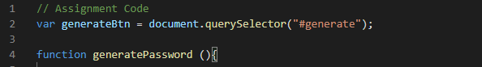
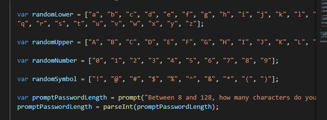
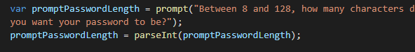
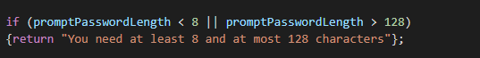
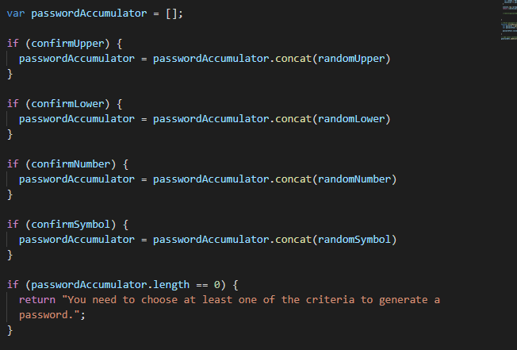
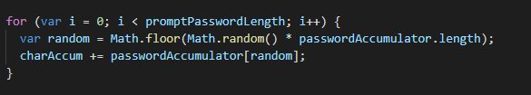

# Password-Generator
Application to generate random password between 8 and 128 characters in length.

### Overview

This assignment was one of the more difficult assignments that I think I have ever completed. The hard part about it was the level of programming logic that was required and for a novice such as myself, it made it hard to know where to even begin. Thankfully, many of us are in the same boat as myself and we were able to work through many concepts together in study groups.

### Variable Assignment

One of the most important things to start with was the assignment of variables. The instructor had thankfully provided us with a starter HTML and CSS document, as well as a small bit of code in the JS file as well. There was a query selector in the start:

As well as a function titled "generatePassword" at the bottom which we were in charge of completing.

First I completed my arrays. There are many ways to do this, but this seemed most logical for the level I am at and it made the most logical sense. I ended up having 4 arrays for all the lower case, upper case, symbols, and nuumbers.

I then created a prompt to ask the user how many characters they would like to have.

If they chose a number that did not sit between 8 and 128 characters, an alert would tell them they must meet the criteria to generate a password.

This prompt variable I created would also hold the value of what the user put in the text area. I then created another line of code that would change that value into an Integer rather than a string of code.

After all of my confirm variables were set, I made another variable titled "passwordAccumulator". This variable was empty, but it was created so that when a user selects to confirm whether they wanted a certain type of character or not, the passwordAccumulator variable would not only house these values, but also append them together as the user confirmed the characters wanted. As an example, if the user only wanted a password made of random numbers and symbols and nothing else, my passwordAccumulator variable would take all of my predefined values in the array for "randomSymbol" and "randomNumber" and place them inside, and then string them all together to form one giant array that the generator could pull from with the random integers that would be created later on. This was also done by using the if statments which featured ".concat" attribute to string them all together.

### Function Creation

I next wanted to create the function which would be in charge of generating a random number, and then pulling from my "passwordAccumulator" variable, and then it would return the characters pulled from the arrays.

I used a for loop, and created a variable called "random" inside of it. This variable would house a randomly generated value. The formula looked like this.

Math.random would generate a random decimal between 0 and 1. I then multiplied that by the number that is housed in the "passwordAccumulator" variable. Remember, it is housing a giant array of all the confirmed characters the user chose from. This number would be a decimal, so in order to make it a whole number that could be used to pull from the array, I used math.floor which rounds that decimal value down. This random variable could then be placed into my "passwordAccumulator" variable and then that random number that was generated will pull from the giant array that was created, thus giving us a random character.

Of course we still need to concatinate these chracters because otherwise the page would only display one value. To do this, I made a variable called "charAccum" to accumulate and append all the values using the "+=" attribute. This means that as long as the condition in my function was true, the generator would create and spit out random characters into my "charAccum" variable until the condition was false, or simply put, the generated password length was less than what the user had requested. This is shown as "i < promptPasswordLength".

Then last, we would return the the variable "charAccum" and this would display the password the generator had made. 

